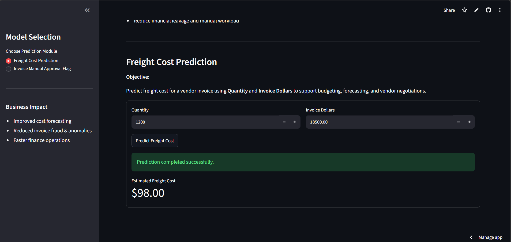
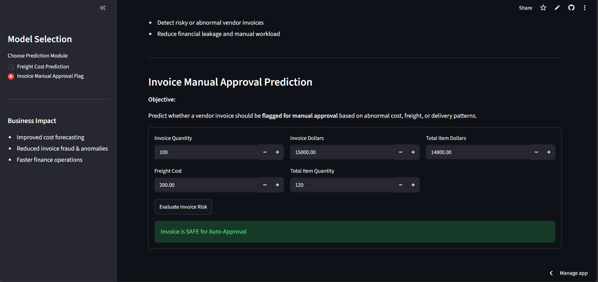

# Vendor Invoice Intelligence Portal

# Live Demo

https://vendor-invoice-intelligence-app-mu2kmbflpxt7bzkdeqfpnj.streamlit.app/

# GitHub Repository

https://github.com/Ashlesha1524/Vendor-invoice-intelligence-portal

An end-to-end Machine Learning application that helps finance and procurement teams:

1. Predict Freight Cost for vendor invoices.
2. Flag invoices that may require Manual Approval.
3. Visualize predictions through an interactive Streamlit dashboard.

---

# Table of Contents

* Project Overview
* Business Objectives
* Data Source
* Machine Learning Models
* Evaluation Metrics
* Streamlit Application
* Project Structure
* How to Run the Project
* Technologies Used
* Author

---

# Project Overview

This project implements a complete Machine Learning pipeline for invoice analytics.

The system uses historical vendor invoice information stored in a SQLite database to:

* Forecast freight costs
* Detect potentially risky invoices
* Improve operational efficiency
* Support financial decision making

---

# Business Objectives

## 1. Freight Cost Prediction (Regression)

### Objective

Predict the expected freight cost for a vendor invoice using historical invoice data.

### Why It Matters

* Supports budgeting and forecasting
* Improves procurement planning
* Helps identify unusual freight charges
* Reduces operational uncertainty

### Inputs

* Invoice Dollars

### Output

* Predicted Freight Cost

---

## 2. Invoice Manual Approval Prediction (Classification)

### Objective

Predict whether a vendor invoice should be manually reviewed before approval.

### Why It Matters

* Detect abnormal invoice behavior
* Reduce financial leakage
* Improve audit efficiency
* Automate invoice processing

### Inputs

* Invoice Quantity
* Invoice Dollars
* Freight Cost
* Total Item Quantity
* Total Item Dollars

### Output

* Manual Approval Required
* Safe for Auto Approval

---

# Data Source

The project uses a SQLite database:

inventory.db

The invoice data is processed and transformed into machine-learning-ready features using Pandas.

---

# Machine Learning Models

## Freight Cost Prediction

The following regression algorithms were evaluated:

* Linear Regression
* Decision Tree Regressor
* Random Forest Regressor

The best-performing model was saved as:

models/predict_freight_model.pkl

---

## Invoice Risk Flagging

The following classification algorithms were evaluated:

* Decision Tree Classifier
* Random Forest Classifier

The best-performing model was saved as:

models/predict_flag_invoice.pkl

---

# Evaluation Metrics

## Regression Metrics

* MAE (Mean Absolute Error)
* RMSE (Root Mean Squared Error)
* R² Score

## Classification Metrics

* Accuracy
* Precision
* Recall
* F1 Score
* Classification Report

---

# Streamlit Application

The project includes a Streamlit-based dashboard with two modules.

## Freight Cost Prediction Module

Users enter:

* Invoice Dollars

The application returns:

* Estimated Freight Cost



---

## Invoice Manual Approval Module

Users enter:

* Invoice Quantity
* Invoice Dollars
* Freight Cost
* Total Item Quantity
* Total Item Dollars

The application returns:

* Manual Approval Required
  or
* Safe for Auto Approval



---

# Project Structure

```text
freight_cost_prediction/
│
├── app.py
├── README.md
├── requirements.txt
│
├── models/
│   ├── predict_freight_model.pkl
│   ├── predict_flag_invoice.pkl
│   └── scaler.pkl
│
├── inference/
│   ├── predict_freight.py
│   ├── predict_invoice.py
│   └── predict_invoice_flag.py
│
├── invoice_flagging/
│   ├── train.py
│   ├── data_preprocessing.py
│   └── modeling_evaluation.py
│
├── train.py
├── data_preprocessing.py
├── model_evaluation.py
└── inventory.db
```

---

# How to Run This Project

## Clone Repository

```bash
git clone https://github.com/yourusername/vendor-invoice-intelligence-portal.git
```

## Install Dependencies

```bash
pip install -r requirements.txt
```

## Test Freight Prediction

```bash
python inference/predict_freight.py
```

## Test Invoice Flag Prediction

```bash
python inference/predict_invoice_flag.py
```

## Launch Streamlit Application

```bash
python -m streamlit run app.py
```

---

# Technologies Used

* Python
* Pandas
* NumPy
* Scikit-Learn
* Joblib
* SQLite
* Streamlit
* VS Code
* Git
* GitHub

---

# Future Improvements

* Add visualization dashboards
* Add model monitoring
* Add invoice anomaly detection
* Integrate REST APIs

---

# Author

Ashlesha Mishra

B.Tech – Computer Science and Data Science
